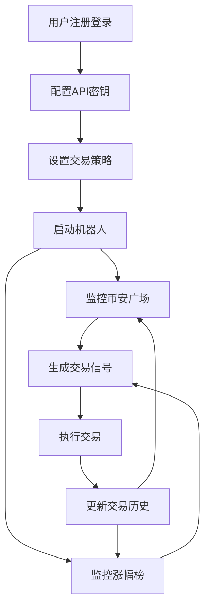

## 1. 产品概览
交易机器人监控币安广场信息和涨幅榜，自动执行交易策略。
- 帮助用户实时监控市场动态，自动执行交易决策，提高交易效率和准确性。
- 目标用户为加密货币投资者，特别是希望自动化交易流程的用户。

## 2. 核心功能

### 2.1 用户角色
| 角色 | 注册方式 | 核心权限 |
|------|---------------------|------------------|
| 普通用户 | 邮箱注册 | 配置交易策略，查看交易历史，管理API密钥 |

### 2.2 功能模块
1. **仪表盘**：市场概览，策略状态，交易历史
2. **策略配置**：设置监控参数，交易规则，风险控制
3. **币安广场监控**：实时监控热门讨论，情绪分析
4. **涨幅榜监控**：实时追踪币种涨跌幅，触发交易信号

### 2.3 页面详情
| 页面名称 | 模块名称 | 功能描述 |
|-----------|-------------|---------------------|
| 仪表盘 | 市场概览 | 显示主要币种价格，涨跌幅，市场情绪指标 |
| 仪表盘 | 策略状态 | 显示当前运行的策略，执行状态，盈亏情况 |
| 仪表盘 | 交易历史 | 记录所有交易操作，包括时间，币种，价格，数量 |
| 策略配置 | 监控参数 | 设置监控频率，触发条件，止盈止损 |
| 策略配置 | 交易规则 | 定义买入卖出条件，资金管理规则 |
| 策略配置 | 风险控制 | 设置最大持仓，单笔交易限额，回撤控制 |
| 币安广场监控 | 热门讨论 | 实时抓取币安广场热门话题，分析讨论热度 |
| 币安广场监控 | 情绪分析 | 对讨论内容进行情感分析，评估市场情绪 |
| 涨幅榜监控 | 实时排行 | 显示24小时涨幅榜，设置涨幅阈值 |
| 涨幅榜监控 | 交易信号 | 基于涨跌幅和成交量生成交易信号 |

## 3. 核心流程
用户注册登录 → 配置API密钥 → 设置交易策略 → 启动机器人 → 监控市场 → 自动执行交易 → 查看交易结果

## 4. 用户界面设计
### 4.1 设计风格
- 主色调：深蓝色 (#1a237e) 和绿色 (#2e7d32)，象征专业和增长
- 按钮风格：圆角矩形，有轻微的阴影效果
- 字体：主标题使用 Roboto Bold，正文使用 Roboto Regular
- 布局风格：卡片式布局，清晰的信息层次
- 图标风格：使用简洁的线性图标，主要来自 lucide-react

### 4.2 页面设计概览
| 页面名称 | 模块名称 | UI元素 |
|-----------|-------------|-------------|
| 仪表盘 | 市场概览 | 大型数字显示价格，红色/绿色指示涨跌，卡片式布局 |
| 仪表盘 | 策略状态 | 状态指示器，进度条显示运行时间，盈利图表 |
| 仪表盘 | 交易历史 | 表格形式，可排序，筛选功能，分页显示 |
| 策略配置 | 监控参数 | 滑块控件，输入框，开关按钮，实时预览 |
| 策略配置 | 交易规则 | 下拉选择，条件编辑器，风险评估指标 |
| 策略配置 | 风险控制 | 百分比输入，最大值设置，警告阈值 |
| 币安广场监控 | 热门讨论 | 滚动列表，热度指示器，情绪标签 |
| 币安广场监控 | 情绪分析 | 饼图显示情绪分布，趋势图表 |
| 涨幅榜监控 | 实时排行 | 表格形式，颜色编码涨跌幅，可点击详情 |
| 涨幅榜监控 | 交易信号 | 信号指示器，触发条件显示，历史信号记录 |

### 4.3 响应性
- 桌面优先设计，支持平板和移动设备自适应
- 移动设备上采用单列布局，简化操作界面
- 触控优化，确保按钮和控件在移动设备上易于点击

### 4.4 3D场景指导
- 无3D场景需求