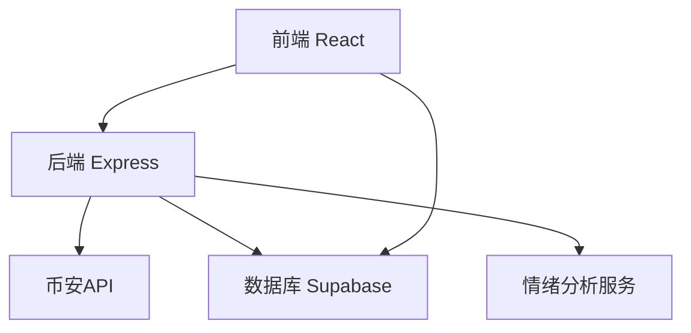
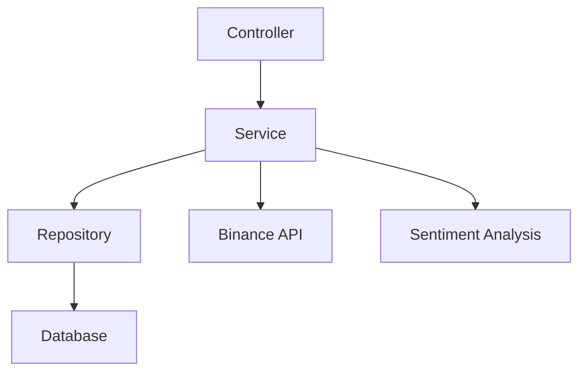
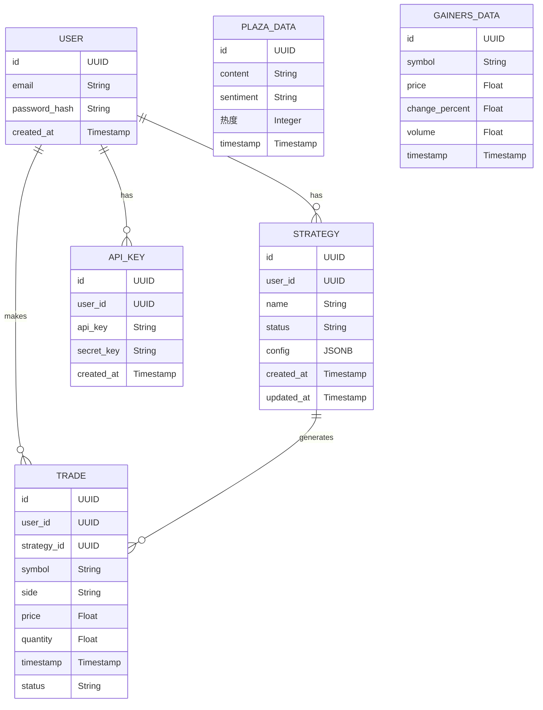

## 1. 架构设计


## 2. 技术描述
- 前端：React@18 + TypeScript + TailwindCSS@3 + Vite
- 后端：Express@4 + TypeScript
- 数据库：Supabase (PostgreSQL)
- 外部服务：币安API，情绪分析API
- 初始化工具：vite-init

## 3. 路由定义
| 路由 | 目的 |
|-------|---------|
| / | 仪表盘页面 |
| /settings | 策略配置页面 |
| /binance-plaza | 币安广场监控页面 |
| /gainers | 涨幅榜监控页面 |
| /api/ | API路由前缀 |
| /api/auth | 认证相关API |
| /api/strategies | 策略管理API |
| /api/trades | 交易历史API |
| /api/binance | 币安数据API |

## 4. API定义

### 4.1 认证API
- POST /api/auth/register：用户注册
- POST /api/auth/login：用户登录
- POST /api/auth/logout：用户登出
- GET /api/auth/me：获取当前用户信息

### 4.2 策略API
- GET /api/strategies：获取策略列表
- POST /api/strategies：创建新策略
- PUT /api/strategies/:id：更新策略
- DELETE /api/strategies/:id：删除策略
- POST /api/strategies/:id/start：启动策略
- POST /api/strategies/:id/stop：停止策略

### 4.3 交易API
- GET /api/trades：获取交易历史
- GET /api/trades/:id：获取单个交易详情

### 4.4 币安API
- GET /api/binance/plaza：获取币安广场数据
- GET /api/binance/gainers：获取涨幅榜数据
- GET /api/binance/price：获取实时价格

## 5. 服务器架构图


## 6. 数据模型

### 6.1 数据模型定义


### 6.2 数据定义语言

#### 用户表
```sql
CREATE TABLE users (
    id UUID PRIMARY KEY DEFAULT gen_random_uuid(),
    email VARCHAR(255) UNIQUE NOT NULL,
    password_hash VARCHAR(255) NOT NULL,
    created_at TIMESTAMP DEFAULT NOW()
);

GRANT SELECT ON users TO anon;
GRANT ALL PRIVILEGES ON users TO authenticated;
```

#### API密钥表
```sql
CREATE TABLE api_keys (
    id UUID PRIMARY KEY DEFAULT gen_random_uuid(),
    user_id UUID REFERENCES users(id),
    api_key VARCHAR(255) NOT NULL,
    secret_key VARCHAR(255) NOT NULL,
    created_at TIMESTAMP DEFAULT NOW()
);

GRANT SELECT ON api_keys TO authenticated;
GRANT ALL PRIVILEGES ON api_keys TO authenticated;
```

#### 策略表
```sql
CREATE TABLE strategies (
    id UUID PRIMARY KEY DEFAULT gen_random_uuid(),
    user_id UUID REFERENCES users(id),
    name VARCHAR(255) NOT NULL,
    status VARCHAR(50) DEFAULT 'inactive',
    config JSONB DEFAULT '{}',
    created_at TIMESTAMP DEFAULT NOW(),
    updated_at TIMESTAMP DEFAULT NOW()
);

GRANT SELECT ON strategies TO authenticated;
GRANT ALL PRIVILEGES ON strategies TO authenticated;
```

#### 交易表
```sql
CREATE TABLE trades (
    id UUID PRIMARY KEY DEFAULT gen_random_uuid(),
    user_id UUID REFERENCES users(id),
    strategy_id UUID REFERENCES strategies(id),
    symbol VARCHAR(50) NOT NULL,
    side VARCHAR(10) NOT NULL,
    price FLOAT NOT NULL,
    quantity FLOAT NOT NULL,
    timestamp TIMESTAMP DEFAULT NOW(),
    status VARCHAR(50) DEFAULT 'completed'
);

GRANT SELECT ON trades TO authenticated;
GRANT ALL PRIVILEGES ON trades TO authenticated;
```

#### 币安广场数据表
```sql
CREATE TABLE plaza_data (
    id UUID PRIMARY KEY DEFAULT gen_random_uuid(),
    content TEXT NOT NULL,
    sentiment VARCHAR(50) NOT NULL,
   热度 INTEGER NOT NULL,
    timestamp TIMESTAMP DEFAULT NOW()
);

GRANT SELECT ON plaza_data TO authenticated;
GRANT ALL PRIVILEGES ON plaza_data TO authenticated;
```

#### 涨幅榜数据表
```sql
CREATE TABLE gainers_data (
    id UUID PRIMARY KEY DEFAULT gen_random_uuid(),
    symbol VARCHAR(50) NOT NULL,
    price FLOAT NOT NULL,
    change_percent FLOAT NOT NULL,
    volume FLOAT NOT NULL,
    timestamp TIMESTAMP DEFAULT NOW()
);

GRANT SELECT ON gainers_data TO authenticated;
GRANT ALL PRIVILEGES ON gainers_data TO authenticated;
```